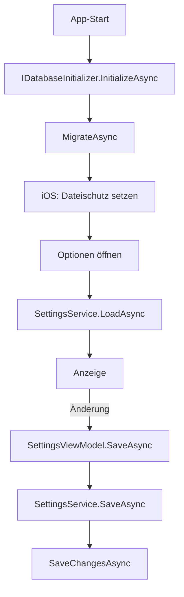

← [Zurück zur Übersicht](index.md)

# Einstellungen — Technischer Ablauf

## Übersicht

Die Einstellungen liegen in einer einzigen lokalen SQLite-Datenbank (`tankatlas.db`), angesprochen über Entity Framework Core 10.0.10 (`Microsoft.EntityFrameworkCore.Sqlite`) im Projekt `Tankradar.MAUI` (Ordner `Data/`). Das Schema wird ausschließlich über Migrationen verwaltet (kein `EnsureCreated`). Der Zugriff der UI erfolgt über `ISettingsService`; die ViewModels kennen keine EF-Typen.

## Ablauf

### 1. App-Start und Datenbankinitialisierung

1. `MauiProgram.CreateMauiApp()` registriert `IDatabaseFileProtector`, `IDatabaseInitializer`, `IDbContextFactory<TankradarDbContext>` (Pfad aus `IAppDataPathProvider.GetDataDirectory()` + `tankatlas.db`, dadurch greift die Testisolation über `TEST_DATA_PATH`) und `ISettingsService`.
2. Der `App`-Konstruktor stößt `IDatabaseInitializer.InitializeAsync()` ohne Warten an.
3. `DatabaseInitializer` legt das Datenverzeichnis an und ruft `Database.MigrateAsync()` auf: Beim ersten Start wird die Datenbank angelegt, bei einem App-Update werden nur ausstehende Migrationen angewendet, vorhandene Daten bleiben erhalten.
4. `IDatabaseFileProtector.Protect(...)` setzt unter iOS `NSFileProtectionCompleteUntilFirstUserAuthentication` auf Verzeichnis, `tankatlas.db`, `-wal` und `-shm` (`#if IOS`); auf anderen Plattformen geschieht nichts. Es gibt keine zusätzliche Verschlüsselung.
5. Der Initialisierungs-Task wird zwischengespeichert; bei einer Ausnahme wird er verworfen, sodass ein späterer Zugriff die Initialisierung wiederholt.

### 2. Einstellungen laden

1. `SettingsPage` erscheint, `SettingsViewModel.OnAppearing()` startet `LoadAsync()`.
2. `SettingsService.LoadAsync()` wartet auf die Initialisierung und liest `UserSettings` (Zeile mit `Id` = 1) sowie alle `FuelTypeSettings` (sortiert nach `SortOrder`).
3. Mapping auf das Domänenmodell `AppSettings`: Fehlende Zeilen oder ungültige Enum-Texte ergeben Standardwerte (`AppSettings.CreateDefault()`); unbekannte Spritsorten-Schlüssel werden ignoriert, fehlende `FuelType`-Werte ans Ende angehängt; sind keine Sorten gespeichert oder keine ausgewählt, gilt die Standardauswahl.
4. Das ViewModel befüllt `FuelTypes`, `GpsOptions`, `ViewOptions`, `SortOptions` mit unterdrücktem Speichern. Bei einer Ausnahme erscheint `StatusMessage`, es werden die Standardwerte angezeigt und nichts gespeichert.

### 3. Änderung und sofortiges Speichern

1. Ein `Switch`, `RadioButton` oder ▲/▼ löst eine Änderung im Element-ViewModel (`FuelTypeItemViewModel`, `ChoiceOptionViewModel<T>`) aus.
2. Das Abwählen der letzten ausgewählten Spritsorte wird zurückgenommen und mit `StatusMessage` gemeldet; es wird nicht gespeichert.
3. `SettingsViewModel.SaveAsync()` (serialisiert über `SemaphoreSlim`, letzter Stand gewinnt) ruft `ISettingsService.SaveAsync(AppSettings)`.
4. `SettingsService.SaveAsync` validiert, lädt die Zeilen, patcht sie (Load-and-Patch, `SortOrder` = Position, `IsSelected`), legt fehlende Zeilen an und führt genau ein `SaveChangesAsync` aus (atomar). Unbekannte vorhandene Schlüssel bleiben unverändert.

## Datenmodell

| Tabelle | Inhalt |
|---------|--------|
| `UserSettings` | Eine Zeile (`Id` = 1): `GpsUsage`, `ResultView`, `ResultSortOrder` |
| `FuelTypeSettings` | Eine Zeile je Spritsorte: `FuelTypeKey` (Primärschlüssel), `SortOrder`, `IsSelected` |

Enum-Werte werden als Text (Enum-Name) gespeichert: `FuelType` (`SuperE5`, `SuperE10`, `Diesel`), `GpsUsage` (`Always`, `WhileInUse`, `Never`), `ResultView` (`List`, `Map`), `ResultSortOrder` (`Price`, `Distance`, `Name`). Die Namen sind ein Persistenzvertrag und durch Tests festgeschrieben. Standardwerte stehen im Code, nicht in Migrationen.

Migrationen liegen unter `src/Tankradar.MAUI/Data/Migrations/` (`InitialCreate`, `AddFuelTypeSettings`). Neue Migration: `dotnet ef migrations add <Name> --project src/Tankradar.MAUI` (Design-Time-Fabrik `TankradarDbContextFactory`).

## Beteiligte Komponenten

- `TankradarDbContext`, `UserSettingsEntity`, `FuelTypeSettingEntity`, `TankradarDbContextFactory`
- `IDatabaseInitializer` / `DatabaseInitializer`, `IDatabaseFileProtector` / `DatabaseFileProtector`
- `ISettingsService` / `SettingsService`, `AppSettings`, `FuelTypeSelection`
- `SettingsViewModel`, `FuelTypeItemViewModel`, `ChoiceOptionViewModel<T>`, `SettingsPage`
- `SettingsTexts` (zentrale UI-Texte, `Resources/Texts/`)
- `IAppDataPathProvider` (einzige Quelle des Datenbankpfads)

## Fehlerbehandlung

- Fehler beim Laden: Meldung „Die Einstellungen konnten nicht geladen werden.“, Standardwerte, kein Speichern.
- Fehler beim Speichern: Meldung „Die Einstellung konnte nicht gespeichert werden.“
- Eine fehlgeschlagene Initialisierung wird nicht dauerhaft gecacht und beim nächsten Zugriff wiederholt.

## Tests

- Unit: `SettingsService`, `SettingsViewModel`, Enums
- Integration: echte SQLite-Datei, Erststart, Migration älterer Schemastände, Neustart
- E2E (FlaUI): Einstellungen ändern und App neu starten; `E2ETestBase` isoliert über `TEST_DATA_PATH`

## Hinweis zu iOS

Das Dateischutzattribut ist nur auf einem iOS-Gerät prüfbar; der Code wird vom iOS-Build in CI kompiliert. Datenbankdateien (`*.db`, `*.sqlite*`) dürfen nicht committet werden (Hook).
