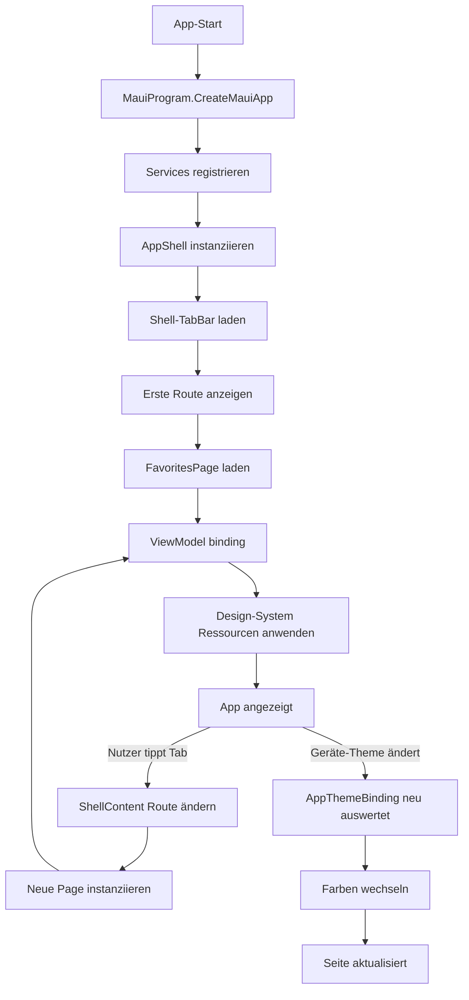

← [Zurück zur Übersicht](index.md)

# Navigation und Design-System — Technischer Ablauf

## Übersicht

Die App-Navigation basiert auf dem MAUI-Shell-Modell mit einer Bottom-TabBar. Beim Start wird die Dependency-Injection aufgebaut, die MainPage wird auf `AppShell` gesetzt, und die erste Route (Favoriten) wird angezeigt. Das Design-System ist als zentrale `ResourceDictionary` implementiert und wird über `AppThemeBinding` zwischen Hell- und Dunkelmodus umgeschaltet.

## Ablauf

### 1. App-Start und MauiProgram-Initialisierung

Die App wird über `App.xaml.cs` gestartet:

1. `App.xaml.cs` aufgerufen
2. `MauiProgram.CreateMauiApp()` erzeugt die MAUI-App-Instanz
3. `MauiProgram.cs` registriert alle Services in der Dependency Injection:
   - `FavoritesViewModel`, `MapViewModel`, `TankbookViewModel`, `SettingsViewModel`
   - `AppConfiguration` (Singleton)
   - Schriftarten via `.AddFont()`
4. Alle ViewModels werden als Transient registriert

Beteiligte Komponenten:
- `App.xaml.cs` — Konstruktor, MainPage-Setzung
- `App.xaml` — Ressourcen-Verweis auf `DesignSystem.xaml`
- `MauiProgram.cs` — Service-Registrierung, DI-Setup
- `AppConfiguration.cs` — Konfigurationsklasse mit Bundle-ID

### 2. Shell-Navigation aufbauen

Nach der MauiProgram-Initialisierung:

1. `App.xaml.cs` setzt `MainPage = new AppShell()`
2. `AppShell.xaml` wird geladen:
   - `<TabBar>` mit vier `<ShellContent>`-Elementen
   - Jeder `ShellContent` hat eine `Route` (z. B. `Route="favorites"`)
   - Jeder verweist auf eine `ContentTemplate` mit einer Page-Klasse
3. MAUI Shell registriert die Routes
4. Bei App-Start wird automatisch die erste Route (Favoriten) angezeigt

Beteiligte Komponenten:
- `AppShell.xaml` — TabBar-Definition mit vier Tabs
- `AppShell.xaml.cs` — Code-Behind (ggf. für zukünftige Anpassungen)
- `FavoritesPage`, `MapPage`, `TankbookPage`, `SettingsPage` — ContentTemplate-Seiten
- MAUI Shell-Navigation (built-in)

### 3. ViewModel-Bindung und Lifecycle

Beim Wechsel zu einem Tab:

1. MAUI Shell lädt die entsprechende Page (via ContentTemplate)
2. Page wird instanziiert (z. B. `FavoritesPage`)
3. Page-Code-Behind (`FavoritesPage.xaml.cs`) setzt `BindingContext = new FavoritesViewModel()` (per DI)
4. Das ViewModel erbt von `BaseViewModel` und implementiert `INotifyPropertyChanged`
5. Falls vorhanden, wird `OnAppearing()` des ViewModels aufgerufen (nicht in Schritt 1 implementiert, aber vorbereitet)

Beteiligte Komponenten:
- `BaseViewModel.cs` — Basis-Klasse mit `INotifyPropertyChanged`, `Title`, `IsBusy`
- `FavoritesViewModel`, `MapViewModel`, `TankbookViewModel`, `SettingsViewModel` — konkrete ViewModels
- `TankradarContentPage.cs` — Custom Page-Klasse (optional, für gemeinsame Page-Logik)

### 4. Design-System-Ressourcen laden

Beim App-Start und bei jedem Laden einer Page:

1. `App.xaml` referenziert `<ResourceDictionary Source="Resources/DesignSystem.xaml" />`
2. `DesignSystem.xaml` wird geladen und alle Ressourcen registriert:
   - Farb-Tokens: `ColorPrimaryTeal`, `ColorBackgroundLight`, `ColorTextPrimaryDark`, etc.
   - Spacing-Tokens: `space-xs` (4px), `space-md` (16px), etc.
   - Border-Radius-Tokens: `rounded`, `rounded-lg`, etc.
   - Shadow-Tokens: `ShadowLevel0` bis `ShadowLevel3`
   - Typografie-Stile: `headline-lg`, `body-md`, `price-hero`, etc.
3. Pages und Controls referenzieren diese Ressourcen via `StaticResource` oder `DynamicResource`

Beteiligte Komponenten:
- `App.xaml` — ResourceDictionary-Verweis
- `Resources/DesignSystem.xaml` — zentrale Ressourcen-Definition
- `FavoritesPage.xaml` und andere — Verwendung der Ressourcen

### 5. Theme-Wechsel (Light/Dark Mode)

Beim Wechsel des Geräte-Themes (z. B. von Light zu Dark):

1. MAUI erkennt `AppThemeChanged` (automatisch oder über `Application.Current.RequestedTheme`)
2. Alle `AppThemeBinding`-Bindings in XAML werden neu ausgewertet
3. `AppThemeBinding Light={...} Dark={...}` wählt die passende Ressource aus
4. Farben, Hintergrund und Text werden sofort aktualisiert

Beispiel aus `FavoritesPage.xaml`:
```xml
BackgroundColor="{AppThemeBinding Light={StaticResource ColorBackgroundLight}, 
                                  Dark={StaticResource ColorBackgroundDark}}"
TextColor="{AppThemeBinding Light={StaticResource ColorTextPrimaryLight}, 
                            Dark={StaticResource ColorTextPrimaryDark}}"
```

Beteiligte Komponenten:
- `DesignSystem.xaml` — Farb-Tokens für Light und Dark
- `App.xaml.cs` — Optional: Event-Handler für `AppThemeChanged` (vorbereitet, aktuell nicht implementiert)
- Alle Pages (XAML) — `AppThemeBinding` für Dynamic Color-Selection
- MAUI Application-Klasse (built-in) — Theme-Verwaltung

## Diagramm



## Fehlerbehandlung

### Font-Loading-Fehler

Falls eine Schriftart (Inter, JetBrains Mono) nicht geladen wird:
- MAUI verwendet automatisch eine System-Schriftart als Fallback
- Visuell ist kein großer Unterschied sichtbar
- Alle Text-Elemente bleiben lesbar

Beteiligte Komponenten:
- `MauiProgram.cs` — `.AddFont()` Aufrufe (Fehler sind still, Fallback ist automatisch)

### Theme-Binding bei älteren MAUI-Versionen

Falls MAUI älter als 8.0 ist (was in diesem Projekt nicht der Fall ist):
- `AppThemeBinding` funktioniert nicht automatisch
- Workaround: Manueller Event-Handler auf `AppThemeChanged` erforderlich

Aktuelles Projekt nutzt .NET 10.0.401 und MAUI 8.0+, daher kein Problem.

### ViewModel-Injection-Fehler

Falls ein ViewModel nicht registriert ist:
- DI wirft eine Exception beim Instanziieren der Page
- Die Page wird nicht angezeigt
- Exception wird in Debug-Ausgabe protokolliert

Schutzmaßnahme:
- Alle vier ViewModels sind in `MauiProgram.cs` registriert
- Bei neuen Pages muss das ViewModel hinzugefügt werden

### AppShell-Route-Konflikt

Falls zwei Routes denselben Namen haben:
- MAUI navigiert zur ersten registrierten Route
- Nachfolgende Routes mit gleichem Namen sind unerreichbar

Schutzmaßnahme:
- Route-Namen in `AppShell.xaml` sind eindeutig (`"favorites"`, `"map"`, `"tankbook"`, `"settings"`)
