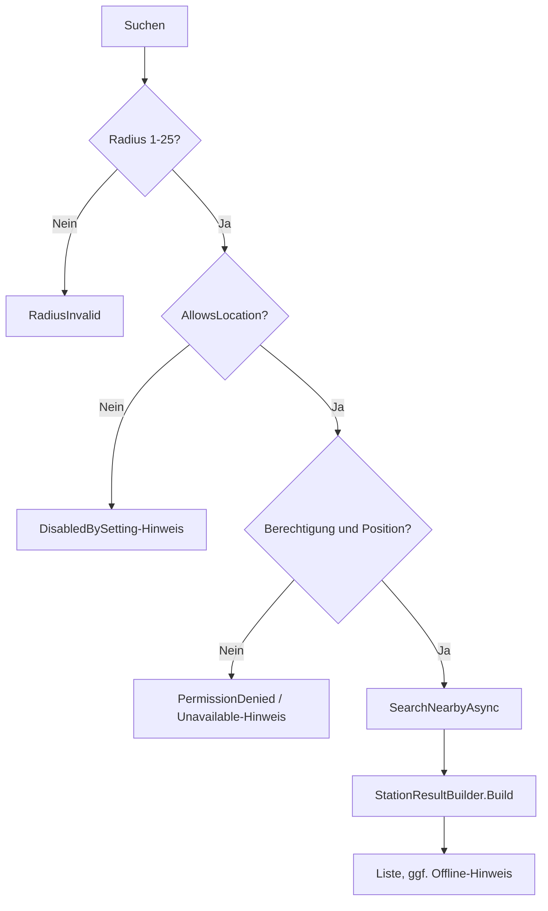
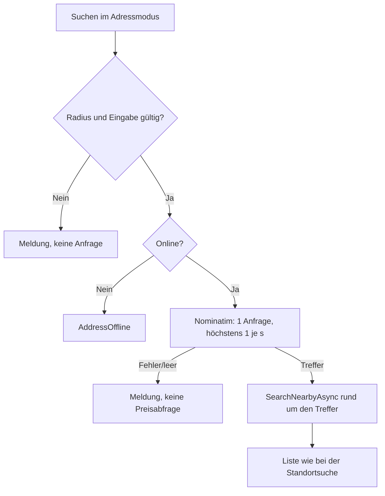

← [Zurück zur Übersicht](index.md)

# Umkreissuche — Technischer Ablauf

## Übersicht

`MapViewModel` (Bereich „Karte“, `MapPage`) prüft den Radius, holt den Standort über `ILocationService`, ruft `IFuelPriceService.SearchNearbyAsync` auf und bereitet das Ergebnis mit `StationResultBuilder` zu `StationListItem`-Zeilen auf. Alle Texte stehen in `SearchTexts`.

| Komponente | Aufgabe |
|------------|---------|
| `MapViewModel` | Suchablauf, `RadiusKm`, `RadiusOptions` (Chips 1/2/5/10/15/25 km, setzen `RadiusKm`), `SearchCommand`, `Stations` (nur die sichtbaren Seiten à `PageSize` 25), `TotalStationCount`, `ShowMoreCommand`, `FuelFilterOptions`, `SortOptions`, `StatusMessage`, `IsOffline`, `SourceNote` |
| `IChoiceOption` | gemeinsame Sicht der Chips (`Label`, `AutomationKey`, `IsSelected`, `SelectCommand`, `SelectionHint`); Implementierungen `RadiusOptionViewModel`, `FuelFilterOptionViewModel`, `ChoiceOptionViewModel<T>` |
| `SearchRadius` | `Min` 1, `Max` 25, `Default` 5, `Steps` 1/2/5/10/15/25; `IsValid` prüft den Bereich; `TryParse` akzeptiert nur Ziffern (nach `Trim`) im Bereich 1–25 |
| `ILocationService` | liefert `LocationResult` (`LocationStatus`: `Available`, `PermissionDenied`, `DisabledBySetting`, `Unavailable`; `GeoPosition`) |
| `MauiLocationService` | Berechtigung `Permissions.LocationWhenInUse`, `Geolocation` (Genauigkeit Medium, Zeitlimit 10 s) |
| `TestLocationService` | fester Standort im Testmodus |
| `LocationServiceSelector` | wählt die Implementierung (`MauiProgram`, Singleton) und parst `TANKATLAS_TEST_LOCATION` |
| `GpsUsageExtensions.AllowsLocation` | erlaubt nur `Always` und `WhileInUse` (Fail Secure) |
| `StationResultBuilder` | Filter, Preiszeilen, Hinweise, Sortierung (rein, ohne Zustand) |
| `SearchMode` | Suchart `CurrentLocation` / `Address`; `MapViewModel.ModeOptions` (Chips, AutomationId `Search.Mode.<Wert>`), `IsAddressMode`, `AddressText`, `ClearAddressCommand`, `ResolvedPlace`, `AttributionText` |
| `AddressInput` | `Validate` normalisiert (Leerraum) und prüft die Eingabe: 3 bis 120 Zeichen, Buchstaben, Ziffern, Leerzeichen und `. , - ' / ( ) & + # :`; Ergebnis `AddressInputError` (`None`, `Empty`, `TooShort`, `TooLong`, `InvalidCharacters`) |
| `IGeocodingService` / `NominatimGeocodingService` | `ResolveAsync` → `GeocodingResult` (`GeocodingStatus`: `Found`, `NotFound`, `InvalidInput`, `Unavailable`, `Rejected`, `InvalidResponse`, `EndpointNotConfigured`; `GeoPosition`, `PlaceName`) |
| `GeocodingOptions` | Basisadresse (HTTPS; HTTP nur Loopback im Testmodus), Zeitlimit 10 s, `MinRequestInterval` mindestens 1 s, `UserAgent`; `FromEnvironment` liest `TANKRADAR_GEOCODING_URL` nur im Testmodus |

## Ablauf `MapViewModel.SearchAsync`

1. Eine laufende Suche wird abgebrochen. Schlägt `SearchRadius.IsValid(RadiusKm)` fehl: `SearchTexts.RadiusInvalid`, kein Standort- und kein API-Aufruf.
2. Einstellungen werden bei Bedarf geladen (`ISettingsService`); Fehler: `SettingsTexts.LoadFailed`.
3. `GetCurrentLocationAsync(settings.GpsUsage)`: Bei `AllowsLocation() == false` kommt `DisabledBySetting` ohne Berechtigungsabfrage. Sonst Berechtigung prüfen/anfragen, dann Position. Status ungleich `Available`: Liste leeren, Hinweis aus `SearchTexts.GetLocationMessage`.
4. `StationSearchQuery(lat, lon, radiusKm, gewählte FuelTypes)` an `IFuelPriceService.SearchNearbyAsync` (Cache, Live, Offline-Rückfall, siehe [Preisdaten](../Preisdaten/ablauf-technisch.md)).
5. `ApplyResult`: `StationResultBuilder.Build`, Meldung aus `SearchTexts.GetFailureMessage(Failure, hasStations)`, `SourceNote` bei `PriceDataSource.OfflineFallback` mit Treffern, `IsOffline` bei fehlender Verbindung oder Rückfall.
6. Ausnahmen (außer Abbruch durch eine neuere Suche bzw. `OnDisappearing`): Liste leeren, `SearchTexts.SearchFailed`; protokolliert wird nur der Ausnahmetyp.

`OnAppearing` lädt nur Einstellungen und abonniert `IConnectionMonitor.ConnectionChanged`; `OnDisappearing` meldet ab und bricht die Suche ab. Filter-/Sortieränderungen rufen `ApplyFilterAndSort` auf (kein Standort-, kein API-Aufruf). Die Standardsortierung kommt aus `AppSettings.ResultSortOrder`.

## Ablauf der Adresssuche

Im Adressmodus ersetzt `ResolveAddressAsync` den Standortschritt (Schritt 3 oben); der übrige Ablauf (Preisdienst, Aufbereitung, Fehlermeldungen) ist identisch:

1. `SearchAsync`: Radius prüfen, danach `AddressInput.Validate` (Meldung aus `SearchTexts.GetAddressInputMessage`, kein Dienstaufruf).
2. Einstellungen laden; ohne Verbindung (`IConnectionMonitor.IsOnline == false`) `SearchTexts.AddressOffline`, keine Anfrage.
3. `IGeocodingService.ResolveAsync`: `NominatimGeocodingService` normalisiert die Eingabe erneut, wartet über eine eigene `RequestThrottle` (Mindestabstand 1 s, getrennt von der Drosselung des Preisdienstes) und sendet genau eine `GET`-Anfrage `search?format=jsonv2&limit=1&countrycodes=de&accept-language=de&q=<Eingabe>` mit `User-Agent` `Tankatlas/0.1 de.martinstromberg.tankradar`, ohne Weiterleitungen, ohne Wiederholung. Status 429/5xx und Netzwerkfehler → `Unavailable`, übrige 4xx/3xx → `Rejected`, leere Liste → `NotFound`, unbrauchbare Koordinaten → `InvalidResponse`.
4. Bei `Found` wird `ResolvedPlace` („Suche rund um: …“) gesetzt und `SearchNearbyAsync` mit der gefundenen Position aufgerufen; die Position lebt nur als lokale Variable. Sonst `SearchTexts.GetGeocodingMessage` (bei fehlender Verbindung „Offline“-Text).

Datenschutz: Eingabe, Ortsname und Position werden weder gespeichert (`SearchPrivacyTests`-Muster in `AddressSearchPrivacyTests_Persistence`) noch protokolliert (nur Statuscodes bzw. Ausnahmetypen); `GeocodingResult.ToString()` liefert nur den Status.

## `StationResultBuilder`

- Berücksichtigt nur gewählte, definierte `FuelType`-Werte; ein Filter außerhalb davon gilt als „Alle“.
- Filter: nur Tankstellen mit Preis der Sorte. Preiszeilen in Einstellungsreihenfolge, je mit `PriceFreshness.FormatAge`/`IsStale`; `StationHints` liefert „Preis unbestätigt“ (nur über angezeigte Preise) und „Automatentankstelle“. Preise im Format „1,859 €“, Entfernung „1,4 km“ (`de-DE`).
- Sortierung: `Price` nach Preis der Filtersorte (sonst erste gewählte Sorte; fehlender Preis zuletzt), dann Entfernung, Name, Id; `Distance` und `Name` mit den jeweils anderen als Nachrang. Namensvergleich `de-DE`, ohne Groß-/Kleinschreibung.

## Datenschutz

Der Standort wird nur im Speicher für die Anfrage verwendet, nie gespeichert oder protokolliert (`MapViewModel` und `MauiLocationService` protokollieren keine Koordinaten; Tests `SearchPrivacyTests_*`). Plattform: iOS/MacCatalyst `NSLocationWhenInUseUsageDescription` („Ermittlung von Tankstellen in der Nähe“), iOS-`PrivacyInfo.xcprivacy` mit `NSPrivacyCollectedDataTypePreciseLocation` (nicht verknüpft, kein Tracking, Zweck App-Funktionalität), Windows `DeviceCapability` `location`.

## Testmodus und manuelle Abnahme unter Windows (ohne GPS)

Windows-Rechner haben meist keinen Standortdienst; ohne Testmodus meldet die Suche dann „Der Standort konnte nicht ermittelt werden…“ (kein stiller Ersatzstandort).

| Variable | Wirkung |
|----------|---------|
| `TANKATLAS_TEST_DATA_PATH` | aktiviert den Testmodus mit isoliertem Datenverzeichnis (der frühere Name `TEST_DATA_PATH` wirkt nicht mehr) |
| `TANKATLAS_TEST_LOCATION` | fester Standort `breite,länge` mit Dezimalpunkt, z. B. `52.5200,13.4050`; nur im Testmodus; fehlend oder ungültig: Standort „nicht ermittelbar“ |
| `TANKRADAR_PRICE_API_URL`, `TANKRADAR_PRICE_API_KEY` | Adresse (HTTP nur Loopback) und Schlüssel des Preisdienstes im Testmodus; ohne Adresse kein Abruf |
| `TANKRADAR_GEOCODING_URL` | Adresse (HTTP nur Loopback) des Ortssuchdienstes (Nominatim-Mock `MockNominatimServer`, `src/TestSupport`) im Testmodus; ohne Adresse keine Adressauflösung (kein Rückfall auf den produktiven Dienst). Der Mindestabstand von 1 s gilt auch im Testmodus |

Abnahme:

1. In der PowerShell-Sitzung setzen: `$env:TANKATLAS_TEST_DATA_PATH = "<leeres Testverzeichnis>"`, `$env:TANKATLAS_TEST_LOCATION = "52.5200,13.4050"`, `$env:TANKRADAR_PRICE_API_URL` und `$env:TANKRADAR_PRICE_API_KEY` auf einen erreichbaren Mock-Preisdienst (`MockTankerkoenigServer`, `src/TestSupport`).
2. App aus derselben Sitzung starten (`dotnet run --project src/Tankradar.MAUI -f net10.0-windows10.0.19041.0` oder `Tankradar.MAUI.exe`).
3. In **Optionen** Spritsorten wählen, dann **Karte** öffnen, Radius setzen, **Suchen**: Liste, Filter und Sortierung prüfen.
4. Prüffälle: **Standort und GPS** = **Nie** (Hinweis, keine Abfrage); `TANKATLAS_TEST_LOCATION` entfernen oder ungültig setzen (Hinweis „Standort nicht ermittelt“); Radiusprüfung über Unit-/Integrationstests (die Oberfläche bietet nur gültige Stufen an); nicht erreichbare Preisdienst-Adresse (Offline-Hinweis).

Die automatisierten Tests nutzen dieselben Variablen: `E2ETestBase` / `SearchE2ETestBase` (FlaUI), `SearchMockServerTestBase` (Integration); Unit-Tests `MapViewModelTests_*`, `StationResultBuilderTests_*`, `LocationService*Tests`, `SearchRadiusTests_Validation`, `TestModeVariableTests_Rename`.

## Darstellung und Leistung

- Filter, Sortierung und Radius sind Chips (`Button` mit Auswahlzustand über `DataTrigger`; `SemanticProperties.Hint` = „Ausgewählt“, AutomationIds `Search.Radius.<km>`, `Search.Filter.<Sorte>`, `Search.Sort.<Wert>`). Ergebniskarten nutzen die Design-Tokens (16 px Rundung, Schattenebene 1, `price-hero` für Preise) und zeigen die Adresszeile (`StationListItem.AddressText`).
- Die Liste bleibt ein `BindableLayout` (nicht virtualisiert), stellt aber höchstens `MapViewModel.PageSize` (25) Karten dar; „Weitere anzeigen“ (`Search.ShowMore`) ergänzt je 25. Filter-, Sortier- und Suchwechsel setzen auf die erste Seite zurück. Abgesichert durch `MapViewModelTests_Chips`, `SearchMockServerTests_RealFormat` (300 Stationen) und `SearchE2ETests_LargeResult`.
- Die Umkreissuche der Quelle (`list.php`) liefert weder `openingTimes` noch `wholeDay`. `FuelPriceService` ergänzt Live-Ergebnisse um Öffnungszeiten aus früheren Detailabfragen (`IPriceRepository.GetKnownDetailsAsync`, `StationInfo.WithDetails`); ohne bekannte Details erscheint kein Hinweis „Automatentankstelle“. Der Mock-Server liefert das reale Format.
- Begründete Abweichungen vom Designentwurf: [ADR 0002](../../adr/0002-search-page-design-deviations.md).
